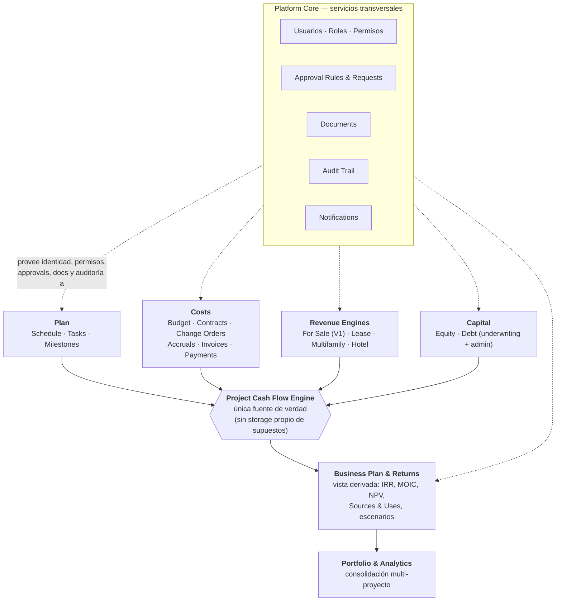
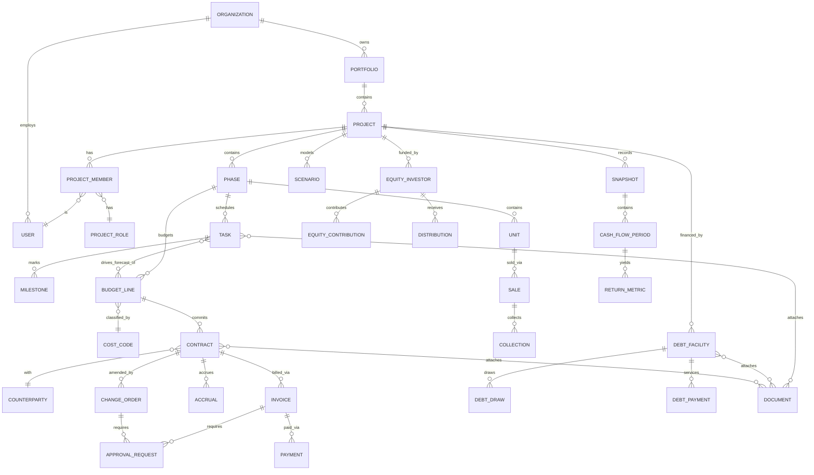
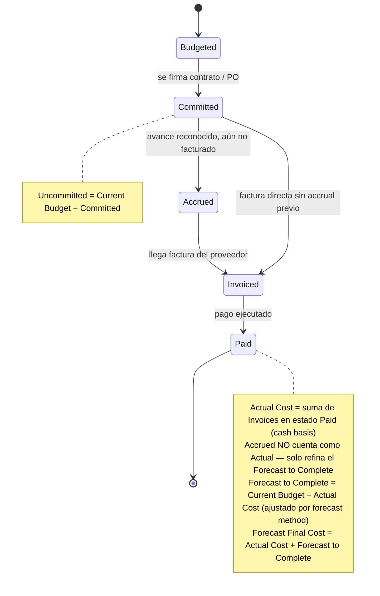
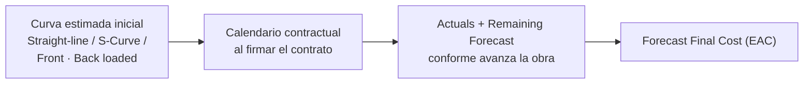
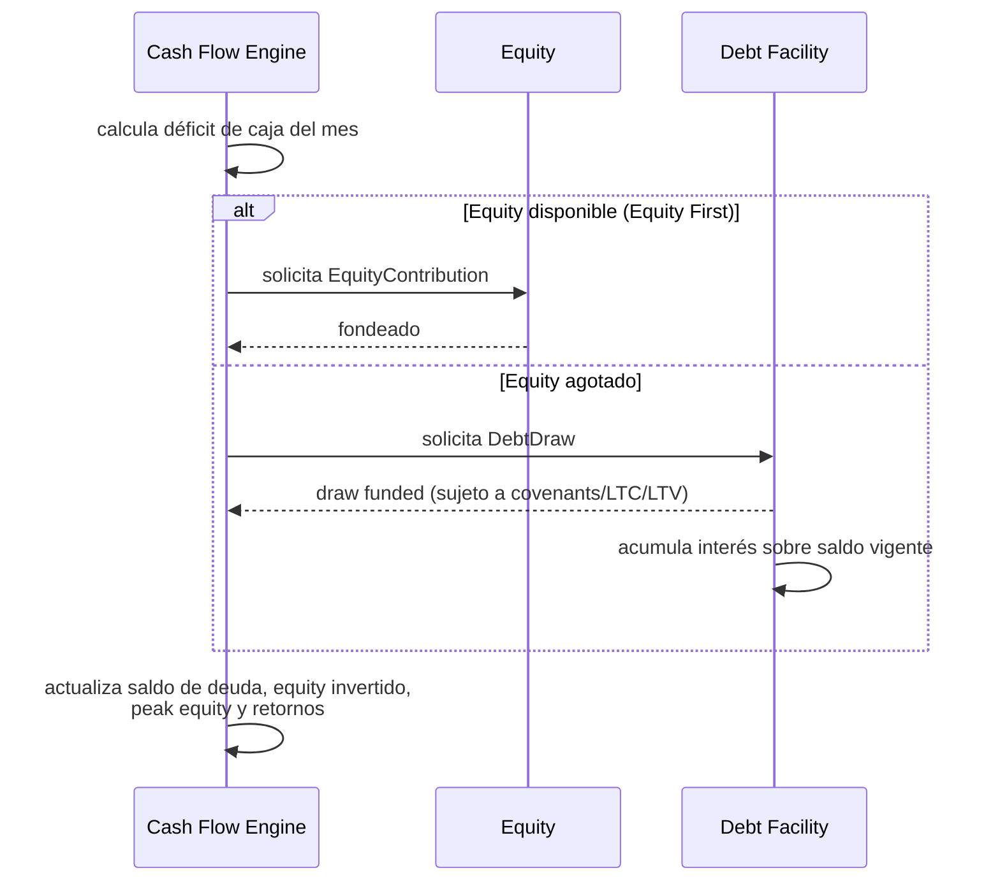
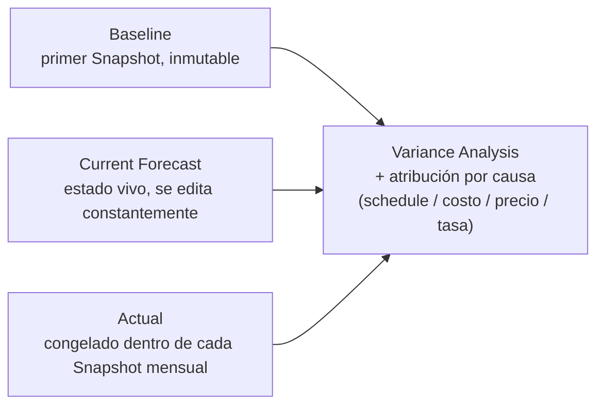
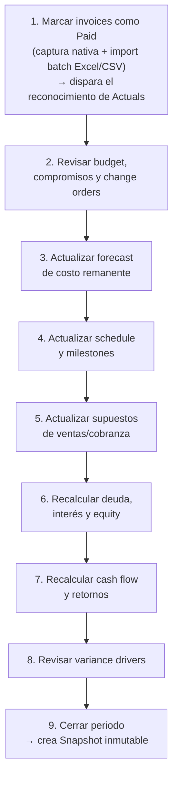

# Real Estate Development OS — Análisis de Producto, Arquitectura y MVP

> **Rol:** revisión de producto tipo Senior PM (PropTech · Real Estate Development · Financial Modeling · SaaS)
> **Insumos:** *Planteamiento Inicial* y *Blueprint v0.2* compartidos por la fundadora
> **Objetivo de este documento:** no resumir los documentos originales, sino **cuestionarlos, tensionarlos y convertirlos en una arquitectura y un MVP ejecutables**.

---

## 0. Resumen ejecutivo

**La tesis central es correcta y es el activo más valioso de los dos documentos:** un solo modelo de datos vivo, donde Schedule, Costs, Revenue y Capital convergen en un único *Project Cash Flow Engine*, es la propuesta de valor real frente a Excel + MS Project + Contpaq/ERP desconectados. Esa tesis **no se debe diluir** y debe ser la única cosa que el equipo protege religiosamente en cada decisión de scope.

**Veredicto general:** el Blueprint v0.2 es un documento de arquitectura inusualmente maduro para una etapa pre-producto — la lógica Budget/Commitment/Accrual/Invoice/Payment, la distinción Baseline/Current/Actual, y el principio de "Enter information once" están bien pensados. El riesgo no es que la visión esté mal planteada; el riesgo es que **la visión completa se confunda con el MVP**. Hay al menos cinco subsistemas en el Blueprint que, si se construyen "bien" desde el día 1, son proyectos de 6-12 meses cada uno por sí solos:

| # | Riesgo de scope creep | Por qué es peligroso ahora |
|---|---|---|
| 1 | Motor de permisos de 3 dimensiones (Module × Action × Data Scope) + Approval Rules genéricas configurables | Es, en la práctica, un rules-engine. Construirlo "configurable" antes de tener 3 clientes reales es apostar meses de ingeniería a una hipótesis de UX de permisos que nadie ha validado. |
| 2 | Funding waterfall configurable (Equity First / Pari Passu / Custom) | Para desarrolladores pequeños/medianos, casi siempre es Equity First. Generalizar antes de necesitarlo es trabajo especulativo. |
| 3 | Soporte simultáneo a 6+ asset classes + Phase/Asset para proyectos mixtos | Cada Revenue Engine (For Sale, Lease, Multifamily, Hotel) es un mini-producto. Construir la abstracción "genérica" antes del segundo motor real casi siempre produce la abstracción equivocada. |
| 4 | "Configurable, not custom-built" sin límites explícitos | Sin una lista cerrada de qué es configurable, se convierte en un template builder infinito. |
| 5 | Templates de proyecto (Residential, Industrial, Multifamily, Hotel, Land) precargando cost codes + schedule + revenue engine + reportes | Es una feature de "día 30 de uso", no de arquitectura fundacional. Construirla antes de tener un solo proyecto real corriendo de punta a punta invierte el orden de aprendizaje. |

**La corrección propuesta en este documento no es "hacer menos"**, es **separar rigurosamente "lo que el data model debe poder soportar sin refactor mayor" de "lo que se construye y expone al usuario en V1"** (sección 5). El MVP disciplinado que se propone en la sección 6 es más angosto que el "MVP 1" del Blueprint: un solo asset class (Residential for Sale), un solo phase por proyecto, Equity First hardcodeado, roles fijos, y actuals capturados manualmente — pero con un data model que ya deja los "ganchos" (foreign keys, campos de tipo, tablas de asociación) para no tener que re-arquitecturar cuando lleguen Multifamily o el segundo asset class.

También se identificaron **tres huecos reales** que ninguno de los dos documentos resolvía. Las tres ya fueron decididas por la fundadora y quedan incorporadas en este documento (ver 1.2, 3.3 y 4.6):

| Hueco | Decisión de la fundadora | Dónde queda modelado |
|---|---|---|
| **Deal/Underwriting ligero** | Sí, se requiere un modo de UW ligero antes de que un Deal se apruebe como Project. | 1.2·2 · 3.3 · 5 |
| **Fuente de los "Actuals"** | Cash basis: un costo se vuelve Actual cuando su Invoice se marca como **Paid** (no antes, aunque tenga Accrual). Captura nativa + **import en batch**. | 1.2·5 · 4.1 · 4.6 |
| **Scenario vs. Snapshot** | `Scenario` (mover supuestos, comparar alternativas) existe **solo dentro del UW**, antes de aprobar el Project. Una vez aprobado, el `Snapshot` es el resumen recurrente de lo aprobado/inicial vs. lo real y lo proyectado hoy — no hay edición de escenarios en ejecución. | 3.3 |

---

## 1. Crítica de la arquitectura actual

### 1.1 Lo que está bien resuelto (no tocar)

- **La jerarquía de convergencia**: todo alimenta un Project Cash Flow Engine único. Es la decisión arquitectónica correcta y debe ser innegociable.
- **La cadena de estados del dinero** `Budget → Commitment → Accrual → Invoice → Payment`. Es exactamente la separación conceptual que le falta a un desarrollador que hoy solo tiene "presupuesto" y "lo que ya pagué" en Excel.
- **Baseline / Current Forecast / Actual** como estados transversales (no solo de costo, sino de schedule, revenue, capital y KPIs). Correcto y debe ser un concepto de primera clase en el modelo de datos, no un campo suelto.
- **Distinguir Sales ≠ Cash Collections** y **Budget ≠ Contract ≠ Payment**. Son las dos confusiones más comunes en modelos de Excel de desarrolladores; resolverlas estructuralmente es una ventaja competitiva real.
- **Org Role vs. Project Role** y la separación de **información financiera sensible** (TIR del sponsor, cap table, promote) del acceso operativo al módulo. Esto es necesario en cualquier plataforma multi-stakeholder desde el día 1 del modelo de datos (aunque no de la UI, ver sección 5).
- Elegir **Residential for Sale** como primer asset class. Es la elección correcta: concentra land, budget, contratos, construcción, ventas, cobranza y deuda — el 80% de la complejidad del producto — sin la complejidad operativa adicional de un activo en renta (NOI recurrente, lease-up, turnover).

### 1.2 Huecos, redundancias y riesgos — detalle

| # | Tema | Problema identificado | Por qué importa | Recomendación |
|---|---|---|---|---|
| 1 | **Business Plan vs. Cash Flow Engine** | El Blueprint lista "Business Plan" como una capa de arquitectura separada (sección 2) pero también dice que "debe ser el resultado de los demás módulos" y que "no debería recapturar" datos (sección 11). Son dos modelos mentales distintos escondidos bajo el mismo nombre. | Si "Business Plan" se implementa como una tabla/módulo con su propio storage, se reintroduce exactamente la duplicación de supuestos que la tesis central promete eliminar. | **Business Plan no es un módulo con datos propios. Es una vista/orquestador sobre el Cash Flow Engine.** No debe existir una tabla `business_plan_assumptions`; solo lecturas derivadas de Plan, Costs, Revenue y Capital. |
| 2 | **Deal / Underwriting desaparecido** | El Planteamiento lo pone como etapa 1 del ciclo de vida (`Deal/Underwriting → Planning → Development → Financing → Operations/Sales → Exit`). El Blueprint arranca directo en "Project Setup Wizard", sin un objeto ni flujo de evaluación pre-compromiso. | Un desarrollador evalúa 10 terrenos/oportunidades por cada proyecto que ejecuta. Obligarlo a llenar el wizard completo (schedule, budget, contratos, equipo) para "solo ver si el número cierra" genera fricción y hace que la plataforma no capture el primer momento de valor. | **✔ Decidido:** sí lleva un modo ligero de UW. Un Deal vive en estado `Draft/Deal`, con un subconjunto mínimo de campos y la capacidad de mover supuestos (ver Scenario en 3.3), y se **promueve a Project** (con Baseline fijado) solo cuando se aprueba. |
| 3 | **Motor de permisos como rules-engine** | 3 dimensiones (Module Access, Action Permission, Data Scope) + Approval Rules configurables por objeto/monto/rol + Custom Role. | Es una cantidad de superficie de configuración comparable a la de un ERP. Construir esto "bien" antes de tener casos reales de uso probablemente produce el diseño equivocado de permisos, no el correcto. | El **modelo de datos** debe soportar las 3 dimensiones desde el día 1 (para no migrar datos después). La **UI y lógica de negocio del MVP** solo expone roles predeterminados fijos + 2-3 reglas de aprobación hardcodeadas por monto. Ver sección 5. |
| 4 | **Scenario vs. Snapshot, relación no definida** | "Scenario Overrides" (Base/Downside/Upside, basados en overrides sobre un escenario base) y "Baseline/Current/Actual" (tres estados transversales con snapshot mensual) se documentan en secciones distintas sin decir si un Snapshot es un tipo de Scenario, si son estructuras independientes, o si el Actual "es" un escenario. | Sin esta decisión, cualquier ingeniero que modele las tablas va a inventar su propia respuesta, y probablemente distinta de lo que el resto del equipo espera. | **✔ Decidido** (ver 3.3): `Scenario` existe **únicamente durante el UW** — es donde se mueven supuestos para comparar alternativas antes de aprobar. Al aprobar, el escenario elegido se congela como Baseline. En ejecución ya no hay Scenarios editables: el `Snapshot` mensual es el resumen de lo aprobado/inicial vs. lo real y lo proyectado hoy. |
| 5 | **Fuente de los "Actuals"** | El Monthly Close (paso 1: "Import/update actuals") y el dashboard ejecutivo asumen que existen actuals de costo y cobranza, pero el documento excluye explícitamente integraciones contables del alcance inicial. | Sin un mecanismo definido, "Actual" es un concepto vacío en el MVP — el rolling forecast no tiene con qué compararse ni de qué alimentarse más allá de lo que ya vive nativamente en la plataforma (invoices/payments capturados a mano). | **✔ Decidido:** actuals en **cash basis** — un costo se reconoce como Actual cuando su `Invoice` pasa a estado **Paid** (Accrued no cuenta como Actual, solo refina el forecast remanente). Fuente: captura nativa (marcar invoice como pagada) **más import en batch** (Excel/CSV) para lo que ya se pagó fuera de la plataforma. No se promete integración contable en V1. |
| 6 | **Funding waterfall configurable** | Equity First, Pari Passu y Custom Waterfall se listan como mecánicas soportadas desde el inicio. | Un motor de waterfall genérico y configurable es, otra vez, ingeniería especulativa: la inmensa mayoría de desarrolladores pequeños/medianos en su primer crédito de construcción usan Equity First simple. | MVP: Equity First hardcodeado. El modelo de datos debe permitir agregar reglas de waterfall alternativas después (no debe estar hardcodeado *en el schema*, sí en la lógica de cálculo inicial). |
| 7 | **"Configurable, not custom-built" sin límites** | Es un principio de producto correcto pero, tal como está escrito, no dice qué es configurable ni hasta dónde. | Sin límites explícitos, cualquier feature request se puede justificar como "solo es hacerlo configurable". Es la puerta de entrada clásica al scope creep de un producto B2B vertical. | Convertirlo en una lista cerrada (sección 6): en V1 solo son configurables la librería de cost codes, la estructura de schedule por template, y los supuestos del revenue engine — nada más. Todo lo demás (permisos, approvals, waterfall, reportes) es fijo en V1. |
| 8 | **Phase/Asset para proyectos mixtos** | Buen diseño para el futuro (hotel + retail + residencial en un mismo desarrollo), pero introduce complejidad de rollup (¿cómo se agregan schedule, budget y cash flow de múltiples fases con distintos revenue engines?) que ningún documento explica. | Resolver el rollup multi-fase multi-asset-class correctamente es, otra vez, un proyecto de ingeniería considerable, y no es necesario para validar la tesis central con el primer cliente. | El modelo de datos mantiene `Phase` como entidad desde el día 1 (todo Project tiene al menos 1 Phase implícita), pero el **MVP no expone UI para múltiples fases o múltiples asset classes por proyecto.** Un proyecto = un asset class = una fase, en V1. |
| 9 | **Falta contexto de mercado (moneda, IVA, retenciones)** | Ninguno de los dos documentos menciona tratamiento fiscal ni multi-moneda. | Si Contracts e Invoices no separan monto neto / impuesto / retención desde el modelo de datos, agregarlo después implica migrar cada tabla financiera del sistema. | **✔ Decidido:** mercado inicial es **USA y México a la vez** (no uno y después el otro). `Project` lleva `currency` (USD/MXN) y `market` (US/MX) desde el día 1; `Contract`/`Invoice` llevan campos genéricos `netAmount`/`taxAmount`/`retentionAmount` capturados **manualmente** — sin motor de cálculo fiscal automático en el MVP (ni tablas de IVA mexicano ni de sales tax por estado en EUA). Ver 3.2 y 8·02. |
| 10 | **Impact Engine / AI dependen de trazabilidad que hoy no está explícita** | Ambas funcionalidades futuras necesitan saber "qué assumption cambió, cuándo, por quién, y qué otros valores se recalcularon en consecuencia" — es decir, versionado de assumptions con linaje. Los documentos las tratan como features de UI de fases posteriores, no como un requisito de modelo de datos. | Si el linaje de cambios no se diseña desde el día 1 (cada assumption versionada, cada recálculo trazable), agregarlo después requiere reconstruir el motor de cálculo, no solo la UI. | Esto sí va en "arquitectura desde el día 1" (sección 5): cada assumption editable debe guardar quién/cuándo/valor anterior, aunque el Impact Engine (la UI que traduce esto en "tu IRR bajó 0.8pts por esto") sea Fase 4-5. |

### 1.3 Redundancias a resolver antes de diseñar pantallas

- **Dashboard ejecutivo (doc 1, sección 15) vs. Project Overview (doc 2, sección 5)**: son la misma pantalla descrita dos veces con KPIs ligeramente distintos. Deben unificarse en una sola especificación antes de wireframes.
- **"Reporting" como módulo de MVP** (doc 1) vs. **Standard Reports por área** (doc 2, sección 14.3): el Blueprint expande esto en ~15 reportes distintos (Budget vs Actual, Commitment Report, Cost Forecast, Change Order Log, Contract Register, Milestone Report, Schedule Variance, Critical Path, Equity Requirements, Debt Schedule, Draw Report, Covenants, Business Plan, Sources & Uses, Returns, Scenario Comparison, Monthly Development Report). Construir 15 reportes "bien" es, otra vez, más trabajo que el resto del MVP junto. Ver sección 6 para el corte real.

---

## 2. Arquitectura de módulos propuesta (refinada)

La arquitectura de capas del Blueprint es correcta en su forma; se refina aquí para hacer explícito que **Business Plan no almacena datos propios** y que **Platform Core es transversal, no una capa más en la pila**.

### Responsabilidades por capa

| Capa | Responsabilidad | Almacena datos propios | No debe hacer |
|---|---|---|---|
| Platform Core | Identidad, roles, permisos, approvals, documentos, notificaciones, audit trail | Sí (usuarios, roles, approval rules, documents, audit log) | No debe contener lógica de negocio de ningún módulo vertical |
| Plan | Schedule, tareas, dependencias, milestones, responsables | Sí (tasks, milestones) | No debe calcular cash flow — solo expone timing a Costs y al Cash Flow Engine |
| Costs | Budget, cost codes, contratos, change orders, accruals, invoices, payments | Sí | No debe decidir cuándo se dispone deuda ni calcular retornos |
| Revenue | Inventario/unidades, pricing, absorción, payment plans, cobranza (V1: For Sale) | Sí | No debe duplicar el cash flow del proyecto — solo expone ingresos/cobranza proyectada y real |
| Capital | Facilities de deuda, draws, covenants, equity investors, contributions/distributions | Sí | No debe recalcular retornos del proyecto (eso es Business Plan, leyendo de Capital) |
| **Business Plan** | **Orquesta** Plan+Costs+Revenue+Capital en un cash flow mensual único y deriva retornos | **No** (solo cachea resultados calculados, versionados por Scenario/Snapshot) | No debe permitir capturar manualmente un número que ya existe en otro módulo |
| Portfolio & Analytics | Consolida N proyectos, dashboards comparativos, forward-looking (equity requerido a 12 meses, vencimientos, etc.) | No (lee de Business Plan de cada proyecto) | — |

---

## 3. Data model principal

### 3.1 Diagrama entidad-relación (núcleo)

### 3.2 Objetos principales — dominios y campos clave

| Dominio | Objeto | Campos/relaciones clave |
|---|---|---|
| Org & Access | `Organization`, `User`, `OrganizationRole`, `ProjectMember`, `ProjectRole`, `PermissionSet` | Ver sección 4.7 |
| Estructura | `Portfolio`, `Project`, `Phase` | `Project.status` (Deal / Active / On Hold / Closed), `Project.assetClass`, `Project.strategy` (Development/Acquisition), **`Project.currency`** (USD/MXN), **`Project.market`** (US/MX) |
| Planeación | `Task`, `Milestone` | `predecessorId`, `lag`, `linkedBudgetLineIds[]`, `progressPct` |
| Costos | `CostCode`, `BudgetLine`, `Contract`, `ChangeOrder`, `Accrual`, `Invoice`, `Payment` | `BudgetLine.originalAmount/currentAmount/committedAmount/paidAmount/forecastAmount` (calculados, no capturados). `Contract`/`Invoice`: **`netAmount`, `taxAmount`, `retentionAmount`** genéricos (captura manual, sin motor fiscal US/MX en MVP) |
| Ingresos | `Unit`, `Sale`, `Collection` (V1); `Lease`, `RevenueAssumption` (fases posteriores) | `Unit.status`, `Sale.priceTotal`, `Sale.paymentPlanId`, `Collection.dueDate/paidDate` |
| Capital | `DebtFacility`, `DebtDraw`, `DebtPayment`, `EquityInvestor`, `EquityContribution`, `Distribution` | `DebtFacility.ltc/ltv/rate/term`, `DebtDraw.status` |
| Business Plan | `Scenario`, `Snapshot`, `CashFlowPeriod`, `ReturnMetric` | Ver 3.3 |
| Platform Core | `Document`, `ApprovalRule`, `ApprovalRequest`, `Comment`, `AuditLog`, `Notification`, `Counterparty` | — |

### 3.3 Decisión de modelado: `Scenario` vs. `Snapshot` (resuelve el hueco #4 de la sección 1)

**Decisión de la fundadora, ya incorporada como modelo definitivo:** `Scenario` y `Snapshot` no conviven en el tiempo — pertenecen a etapas distintas del ciclo de vida del proyecto y no son intercambiables.

| Concepto | Qué es | Cuándo existe | Mutabilidad |
|---|---|---|---|
| **Scenario** | Conjunto de *overrides hipotéticos* sobre los supuestos (precio, costo, ritmo de venta, tasa, plazo) para comparar alternativas — "¿qué pasaría si...?" | **Solo durante el Deal/Underwriting**, antes de que el proyecto se apruebe. Un Deal puede tener varios Scenarios (Base/Downside/Upside) mientras se evalúa. | Editable y recalculable en vivo mientras el Deal está en UW |
| **Baseline** | El `Scenario` que se **elige y aprueba** al promover el Deal a Project. Se congela como el primer `Snapshot`. | Se fija exactamente una vez, al aprobar | Inmutable desde ese momento |
| **Current Forecast** | El estado vivo y editable de Plan+Costs+Revenue+Capital *ahora mismo*, en ejecución | Desde que el Project está aprobado, todo el tiempo | Mutable constantemente — **no** es un Scenario ni se edita por overrides hipotéticos |
| **Actual** | Lo realmente ocurrido a la fecha de corte (ver 4.1: costos = invoices pagadas) | Desde que el Project está aprobado, se acumula cada mes | Se congela dentro de cada `Snapshot` mensual |
| **Snapshot** | La fotografía mensual que resume, para ese corte: **Baseline (lo aprobado/inicial) vs. Actual (lo real) vs. Current Forecast (lo proyectado hoy)** | Se genera en cada Monthly Close, durante toda la ejecución | Inmutable una vez creado |

**En una frase:** *Scenario* es la caja de arena del Underwriting — ahí se mueven supuestos para decidir si y cómo aprobar el Deal. Una vez aprobado, esa libertad se cierra: ya no hay Scenarios editables en ejecución, solo el ciclo mensual Baseline→Actual→Current Forecast que el `Snapshot` resume. Esto también simplifica el MVP: no hace falta un motor de escenarios "always-on" en Business Plan (sección 6), solo dentro del wizard de UW.

---

## 4. Workflows profundizados

### 4.1 Budget → Commitment → Accrual → Invoice → Payment

**Por qué importa modelarlo así:** cada `BudgetLine` debe poder responder, en cualquier momento, cinco números distintos (Original, Current, Committed, Actual, Forecast Final) sin que ninguno se capture manualmente — todos se derivan de las transacciones (`Contract`, `ChangeOrder`, `Accrual`, `Invoice`, `Payment`) ligadas a ella. **Decisión de la fundadora:** el reconocimiento de Actual es en *cash basis* — una partida solo pasa a Actual cuando su `Invoice` se marca como **Paid**; el `Accrual` (avance reconocido, aún no facturado) sigue siendo insumo del forecast remanente, pero nunca de Actual. Esto simplifica el MVP frente a un reconocimiento devengado (accrual accounting) completo, al costo de que Actual Cost puede ir un poco "atrasado" respecto al avance físico real — trade-off aceptado deliberadamente. Si en el MVP se permite editar "Forecast Final Cost" directamente sobre la partida sin pasar por el método de forecast (sección 4.2), se rompe la trazabilidad y se reintroduce el Excel disfrazado de software.

### 4.2 Cost Forecast mensual (rolling forecast)

Cada `BudgetLine` tiene un `forecastMethod` que **cambia de fase automáticamente**: antes de contratar, usa una curva genérica (Straight-line/S-Curve); al firmar contrato, adopta el calendario de pago pactado; conforme se acumulan accruals/invoices/payments reales, el forecast del periodo transcurrido se reemplaza por el actual y solo el remanente sigue proyectado. Esto es lo que el Blueprint llama "Rolling Forecast" y es, junto con el Cash Flow Engine, **el corazón técnico del producto** — se recomienda prototipar esto antes que ninguna pantalla (ver sección 10).

### 4.3 Project Cash Flow Engine — composición mensual

| Bloque | Entradas | Frecuencia de recálculo |
|---|---|---|
| Ingresos | `Collection` (V1: cobranza de ventas residenciales) | Cada cambio en pricing/absorción/payment plan, o actual de cobranza |
| Egresos | Forecast mensual por `BudgetLine` (sección 4.2) | Cada cambio de budget, contrato, CO, o actual |
| Deuda | `DebtDraw`, interés devengado sobre saldo, `DebtPayment` | Cada mes, en función del déficit de caja neto |
| Equity | `EquityContribution`, `Distribution` | Cada mes, según el orden del funding waterfall (V1: Equity First) |
| Retornos | Derivados del cash flow neto acumulado (unlevered y levered) | Recalculado en cada edición — no se "corre" manualmente |

El Cash Flow Engine no es una pantalla, es la función de cálculo que corre cada vez que cambia cualquier input de Plan, Costs, Revenue o Capital. Las pantallas (Project Cash Flow, Returns, Business Plan) son **lecturas** de su resultado.

### 4.4 Debt — underwriting → draws → administración

**Pregunta operativa que el usuario debe poder responder de inmediato** (correctamente señalada en el Planteamiento): *"¿Cuánto equity necesito aportar el próximo mes?"* — esto solo es posible si el draw mechanics corre automáticamente sobre el forecast mensual, no si es un cálculo manual en una hoja aparte.

### 4.5 Baseline vs. Current Forecast vs. Actual

La atribución de varianza (ejemplo del Blueprint: "-40 bps por retraso, -70 bps por incremento en construcción, +30 bps por precios, -20 bps por tasa") requiere que cada `Snapshot` mensual guarde **no solo los totales, sino los deltas por causa** respecto al snapshot anterior. Esto es más exigente de lo que aparenta y debe decidirse en el diseño del `Snapshot` desde el MVP, aunque la atribución automática completa se libere en Fase 2 (el Blueprint ya lo pone correctamente ahí).

### 4.6 Monthly Close

Los 9 pasos del Blueprint son correctos como flujo; se ajustan aquí para reflejar la decisión sobre el hueco #5 — actuals en cash basis vía invoices pagadas:

El Monthly Close es, junto con el Cash Flow Engine, **el workflow que justifica la suscripción recurrente** (es el momento en que el usuario vuelve al producto cada mes). Vale la pena diseñarlo con el mismo cuidado que una pantalla, no tratarlo como un checklist secundario.

### 4.7 Equipos, roles, permisos y approvals

| Dimensión del Blueprint | ¿Va en el modelo de datos del MVP? | ¿Va en la UI/lógica del MVP? |
|---|---|---|
| Org Role vs. Project Role | Sí | Sí (simplificado: un usuario tiene un rol por proyecto) |
| Module Access (qué módulos ve) | Sí (campo en `PermissionSet`) | Sí, pero derivado del rol fijo, no configurable por el usuario |
| Action Permission (View/Edit/Approve/Admin) | Sí | Sí, igual: derivado del rol, no una matriz editable |
| Data Scope granular (una fase, un vendor, un rango de cost codes) | Sí (tabla de asociación preparada) | **No en V1** — en V1 el scope es "todo el proyecto" o "nada" |
| Approval Rules configurables por objeto/monto/rol | Sí (tabla `ApprovalRule`) | **No editable por el usuario en V1** — 2-3 reglas hardcodeadas (ej. Change Order > $X requiere rol Y) |
| Internal vs. External Collaborator | Sí | Sí — el "workspace limitado" (My Tasks, My Contracts, My Approvals) es de alto valor para contratistas/consultores y relativamente barato de construir; se recomienda incluirlo en V1 |
| Información financiera sensible oculta por rol | Sí (flag en `PermissionSet`) | Sí — ocultar TIR/equity/cap table a roles operativos es simple y muy valorado por sponsors, se recomienda incluirlo en V1 |

---

## 5. Arquitectura desde el día 1 vs. Construcción en el MVP

Esta es la tabla más importante del documento — es la que evita tanto el sub-diseño (deuda técnica cara) como el sobre-diseño (parálisis por generalización prematura).

| Capacidad | ¿Arquitectura/modelo de datos día 1? | ¿Se construye en MVP? | Nota |
|---|---|---|---|
| Project Cash Flow Engine único | Sí | Sí | Núcleo del producto, no es negociable |
| Budget/Commitment/Accrual/Invoice/Payment | Sí | Sí | Núcleo del producto |
| Rolling cost forecast mensual | Sí | Sí | Núcleo del producto |
| Baseline/Current/Actual (Snapshot mensual) | Sí | Sí | Núcleo del producto |
| Multi-mercado (USA + México), multi-moneda | Sí — `Project.currency`/`market`, campos fiscales genéricos en Contract/Invoice | Sí, pero **captura manual** de impuestos/retención — sin motor de cálculo fiscal automático ni conversión de FX entre proyectos | Decisión de la fundadora (8·02); un proyecto = una moneda, sin consolidación multi-moneda de portafolio en V1 |
| Scenario overrides (Base/Downside/Upside) | Sí (tabla `Scenario`) | **Sí, pero acotado al Deal/UW** — múltiples Scenarios mientras se evalúa el Deal; ninguno editable ya aprobado el Project | Decisión de la fundadora (3.3): scope de Scenario = solo UW, sin motor de sensibilidad en ejecución |
| Multi asset class (Lease, Multifamily, Hotel) | Sí (campo `assetClass`, `RevenueEngine` como interfaz) | **No** — solo For Sale implementado | Construir el 2º motor real informa la abstracción correcta |
| Multi-phase / mixed-use | Sí (entidad `Phase` siempre presente) | **No** — UI limita a 1 fase por proyecto | — |
| Deal/Underwriting ligero | Sí (`Project.status = Deal`) | **Sí, mínimo** — reutiliza el wizard con 5 campos, sin schedule/team completo | Resuelve el hueco #2; es barato si el modelo ya soporta el estado |
| Permisos 3D (Module/Action/DataScope) | Sí (schema completo) | **Parcial** — Data Scope no editable, roles fijos | Evita migración de datos de permisos después |
| Approval Rules configurables | Sí (tabla `ApprovalRule`) | **No editable** — reglas hardcodeadas por objeto/monto | — |
| Funding waterfall (Equity First/Pari Passu/Custom) | Sí (interfaz de cálculo desacoplada) | **No** — solo Equity First | — |
| Debt covenants / lender reporting | Sí (campos en `DebtFacility`) | Mínimo — captura manual, sin alertas automáticas | Fase 2 |
| Versionado de assumptions con linaje (para Impact Engine / AI) | **Sí — crítico** | No expuesto en UI | Si no se diseña ahora, Impact Engine/AI se vuelve un proyecto de re-arquitectura después |
| Templates de proyecto | Sí (campo `templateId`) | Mínimo — 1 solo template real (Residential Development) | — |
| Reportes exportables | Sí (capa de export desacoplada de cada módulo) | Solo 4-5 reportes (ver sección 6) | — |
| Documents & Audit Trail | Sí | Sí (básico: adjuntar archivo, log de cambios en objetos financieros) | Barato y de alto valor de confianza |
| Portfolio consolidado multi-proyecto | Sí (Project siempre pertenece a Portfolio) | **No** — dashboard multi-proyecto es Fase 2 | Un solo desarrollador de "pequeño/mediano" en V1 puede tener 1-3 proyectos activos; no es la prioridad |

---

## 6. MVP disciplinado (propuesta revisada)

Más angosto que el "MVP 1" del Blueprint en los puntos marcados con ⚠️, con justificación.

| Módulo | Alcance MVP propuesto | Corte respecto al Blueprint | Justificación del corte |
|---|---|---|---|
| **Core** | Project setup **con modo Deal/UW** (estado `Draft/Deal`, Scenarios comparables, promoción a Project al aprobar), roles fijos, team por proyecto, internal/external collaborator | ⚠️ Sin Custom Role, sin Data Scope granular editable | Roles fijos cubren el 90% de los casos de un equipo de <15 personas; el modo Deal es explícitamente parte del MVP (decisión de la fundadora) |
| **Plan** | Schedule, Gantt, milestones, dependencias, 1 sola fase por proyecto | ⚠️ Sin multi-fase/mixed-use | Un proyecto residencial típico no lo necesita para validar la tesis |
| **Costs** | Budget jerárquico, contratos, change orders, invoices, payments, forecast mensual con los 8 métodos de curva | Igual que el Blueprint | Es el módulo más maduro del planteamiento; construirlo completo |
| **Cost Forecast** | Rolling forecast automático (sección 4.2) | Igual que el Blueprint | Núcleo técnico |
| **Revenue** | Solo motor **For Sale** (inventario, pricing, absorción, payment plans, cobranza) | ⚠️ Sin Lease/Multifamily/Hotel | Un solo motor bien hecho > cuatro motores mediocres |
| **Capital** | Equity (sources, contributions), 1 crédito de construcción, draws automáticos, Equity First hardcodeado | ⚠️ Sin waterfall configurable, sin covenants avanzados | Cubre "cuánto equity necesito el próximo mes" sin construir un motor de waterfall genérico |
| **Business Plan** | Cash flow del proyecto, Sources & Uses, IRR, MOIC, NPV. Los Scenarios viven en el módulo de Deal/UW (no aquí); en ejecución, Business Plan solo muestra Baseline vs. Actual vs. Current Forecast por Snapshot | ⚠️ Sin motor de sensibilidad multi-variable en ejecución | Valida la promesa central sin construir el Impact Engine; el "qué pasaría si" ya se resolvió en el UW antes de aprobar |
| **Monthly Close** | Flujo completo de 9 pasos, genera Snapshot | Igual que el Blueprint | Es el hábito recurrente que retiene al usuario |
| **Governance** | Approvals hardcodeados (Change Order y Budget Change por monto), notifications básicas, audit trail en objetos financieros | ⚠️ Sin motor de reglas configurable | — |
| **Reporting** | Dashboard, Budget vs Actual, Cost Forecast, Business Plan/Returns, export a Excel | ⚠️ Reducido de ~15 reportes a 4-5 | Los demás reportes son recortes distintos de los mismos datos — se agregan cuando un cliente real los pida, no antes |
| **Import/Export** | Import de budget y schedule inicial desde Excel (mapeo de columnas); import manual de actuals; export de todo a Excel | Igual de crítico que el Blueprint, pero especificado (antes decía solo "compatibilidad robusta") | Es el puente real desde donde vive hoy el usuario |
| **Portfolio** | No incluido (vista de "mis proyectos" simple, sin analytics consolidado) | ⚠️ Removido del Blueprint MVP1 | Un desarrollador con 1-3 proyectos no necesita analytics de portafolio para adoptar el producto |

**Lo que definitivamente NO entra en el MVP** (ya acertadamente excluido por los documentos, se ratifica): contabilidad completa, impuestos, payroll, CRM, procurement sofisticado, RFI/submittals/field management, BIM, investor portal, asset management post-estabilización, funding waterfall configurable, permisos configurables por el usuario, multi-asset-class, multi-fase, Impact Engine (UI), capa de AI.

---

## 7. Pantallas y workflows principales del MVP

### 7.1 Inventario de pantallas (revisado)

| # | Pantalla | Notas vs. Blueprint |
|---|---|---|
| 1 | Home / Mis Proyectos | Reemplaza "Portfolio Home" — lista simple, sin analytics consolidado |
| 2 | Project Dashboard | Unifica el "Dashboard ejecutivo" del Planteamiento y el "Project Overview" del Blueprint |
| 3 | Project Setup Wizard (incl. modo Deal/UW rápido, con comparación de Scenarios) | Agrega el modo ligero de underwriting; aquí y solo aquí se mueven supuestos y se comparan Scenarios antes de aprobar |
| 4 | Project Team & Permisos | Roles fijos, sin editor de permisos custom |
| 5 | Schedule / Gantt | — |
| 6 | Budget (jerárquico) | — |
| 7 | Budget Line Detail | — |
| 8 | Contracts (lista) | — |
| 9 | Contract Detail | — |
| 10 | Change Orders / Invoices (con approvals) | — |
| 11 | Cost Forecast | — |
| 12 | Residential Inventory | — |
| 13 | Sales / Collections Forecast | — |
| 14 | Debt Facility | — |
| 15 | Debt Draws | — |
| 16 | Project Cash Flow | — |
| 17 | Returns / Business Plan | — |
| 18 | Monthly Close (wizard de 9 pasos) | — |
| 19 | My Approvals | Vista transversal para aprobadores |
| 20 | Reports & Export | 4-5 reportes, no 15 |

*Removidas del inventario del Blueprint para V1: Scenario Comparison (dashboard dedicado), Portfolio Home con analytics, Role Template editor, Permissions Matrix editor, Approval Rules editor.*

### 7.2 Flujos de usuario críticos (detalle)

**A. "Registrar una factura y ver su impacto en el forecast"**
1. Usuario (rol Construction/PM) abre `Contract Detail` → botón "Nueva factura".
2. Captura monto, fecha, adjunta PDF. Sistema pre-llena Cost Code y Vendor desde el contrato.
3. Si monto excede el umbral de aprobación → se crea `ApprovalRequest`, notificación al aprobador.
4. Al aprobarse, el `BudgetLine` recalcula automáticamente: Committed (sin cambio), Actual Cost (+), Forecast to Complete (–), Forecast Final Cost (recalculado según método de forecast).
5. El `Project Cash Flow` del mes correspondiente se actualiza; si genera déficit, el motor de funding recalcula si toca equity o draw.
6. El Dashboard refleja el nuevo Forecast Final Cost y la variación vs. Current Forecast anterior, sin que el usuario haya tocado ninguna otra pantalla.

**B. "Aprobar un Change Order"**
1. PM crea `ChangeOrder` sobre un `Contract`, indica Cost Impact y Schedule Impact.
2. Sistema calcula el nuevo Current Budget de la partida afectada y, si hay Schedule Impact, sugiere el ajuste en `Plan`.
3. Según monto, se enruta a `ApprovalRequest` (regla hardcodeada: <$100k PM, $100k-$500k Director, >$500k CEO).
4. Aprobador ve, en una sola pantalla, el Change Order + su impacto en Budget + su impacto en el Business Plan (IRR antes/después) antes de decidir — esta vista combinada es la versión "V0" del Impact Engine y no requiere el motor genérico completo.
5. Al aprobar, el contrato se amenda, el budget se actualiza, y queda registro en Audit Trail.

**C. "Cerrar el mes"** — ver diagrama de la sección 4.6. Se agrega aquí solo la nota de UX: debe ser un *wizard guiado de una sola sesión* (no 9 pantallas sueltas), con barra de progreso y posibilidad de guardar y continuar — es el workflow que más se parece a "cerrar los libros" y donde el usuario tolera menos fricción.

---

## 8. Decisiones de producto (decision log — 12/12 cerradas)

Las 12 decisiones que bloqueaban empezar a diseñar o programar ya fueron resueltas por la fundadora. Queda como registro histórico de qué se decidió y por qué, no como lista de pendientes.

| # | Decisión | Opciones | Decisión final | Por qué era urgente decidirlo |
|---|---|---|---|---|
| 1 | ¿El MVP incluye un modo "Deal/Underwriting" ligero? | (a) No, arrancar directo en Project Setup completo; (b) Sí, wizard reducido promovible a Project | **✔ Decidido: (b)** — además, el Deal permite mover supuestos y comparar Scenarios antes de aprobar (ver 3.3) | Define el primer momento de valor y si el modelo de `Project` necesita un estado `Draft/Deal` desde el diseño de tablas |
| 2 | ¿Cuál es el mercado inicial (moneda, fiscalidad)? | México con IVA/retención; EUA con tratamiento fiscal propio; ambos a la vez | **✔ Decidido: USA y México simultáneamente.** `Project.currency` + `Project.market` desde el día 1; `Contract`/`Invoice` con campos genéricos net/tax/retention capturados a mano — ningún motor de cálculo fiscal automático (IVA mexicano o sales tax por estado) en el MVP | Agregar campos de impuestos/moneda después implica migrar todas las tablas financieras; al ser 2 mercados desde el inicio, el modelo no puede asumir un solo régimen fiscal ni una sola moneda |
| 3 | ¿Cómo entran los "Actuals" en el MVP? | (a) Solo lo capturado nativamente; (b) + import manual Excel/CSV; (c) integración contable real | **✔ Decidido: (b), en cash basis** — Actual = Invoice marcada como Paid, capturada a mano o importada en batch | Sin esto, el Monthly Close no tiene qué "importar" en su paso 1 |
| 4 | ¿Se soporta más de un asset class en el MVP? | (a) Solo Residential for Sale; (b) Residential + 1 más | **✔ Decidido: (a)** | Cada motor adicional es meses de trabajo; validar con uno antes de generalizar |
| 5 | ¿Se soporta multi-fase/mixed-use en la UI del MVP? | (a) No, 1 fase por proyecto; (b) Sí desde V1 | **✔ Decidido: (a)** | El rollup multi-fase es complejidad no validada aún |
| 6 | ¿Permisos configurables por el usuario en V1? | (a) Roles fijos predeterminados; (b) Editor de roles/permisos custom | **✔ Decidido: (a)** | Un editor de permisos es una feature de producto maduro, no de MVP |
| 7 | ¿Qué funding waterfall se soporta en V1? | (a) Solo Equity First; (b) Configurable desde V1 | **✔ Decidido: (a)** | Cubre el caso real de la mayoría de desarrolladores pequeños/medianos |
| 8 | ¿Cuántos reportes estándar entran al MVP? | (a) 4-5 reportes core; (b) Los ~15 del Blueprint | **✔ Decidido: (a)** | Cada reporte es una superficie de mantenimiento; agregar bajo demanda real |
| 9 | ¿El Business Plan permite capturar assumptions manualmente o solo lee de otros módulos? | (a) Solo lectura derivada; (b) Permite overrides manuales "temporales" | **✔ Decidido: (a), estrictamente** — consistente con que los overrides ("Scenarios") solo existen en el Deal/UW, nunca dentro de Business Plan en ejecución | Permitir overrides manuales reintroduce la duplicación que la tesis central promete eliminar |
| 10 | ¿Se versiona el linaje de cada assumption desde el día 1? | (a) Sí, aunque no se exponga en UI; (b) Se agrega cuando se construya el Impact Engine | **✔ Decidido: (a)** | Agregarlo después requiere reconstruir el motor de cálculo, no solo la UI |
| 11 | ¿Templates de proyecto en V1? | (a) Uno solo (Residential Development), hardcodeado; (b) Sistema de templates configurable | **✔ Decidido: (a)** | El sistema de templates es prematuro sin 2-3 proyectos reales corriendo |
| 12 | ¿Portfolio dashboard en V1? | (a) No, solo lista simple de proyectos; (b) Sí, con analytics consolidado | **✔ Decidido: (a)** | Baja prioridad para un usuario con 1-3 proyectos activos |

**Las 12 decisiones quedan cerradas.** Todas confirman la lectura disciplinada de las secciones 5 y 6 — ningún ajuste adicional al alcance del MVP a partir de este cierre.

---

## 9. Principios de UX para evitar sensación de ERP

1. **Progressive disclosure real, no solo un dashboard bonito encima de tablas complejas**: cada pantalla de resumen (Dashboard, Budget) debe permitir navegar al detalle transaccional (Contract → Invoice → Payment) en máximo 2 clics, pero **no debe mostrar esa jerarquía completa por default**.
2. **Edición inline sobre formularios modales pesados**: capturar una factura o ajustar un forecast debería sentirse como editar una hoja de cálculo moderna (tipo Airtable/Notion), no como llenar un formulario de SAP.
3. **Excel como ciudadano de primera clase, no como "feature de migración"**: import/export no es solo compatibilidad — debe permitir pegar/copiar rangos de celdas directamente sobre tablas de la plataforma (budget lines, schedule, unit inventory).
4. **Un solo lugar para "qué necesita mi atención"**: `My Approvals` + `Notifications` deben vivir en un solo lugar transversal, no dispersos por módulo, para que el usuario no tenga que recorrer 6 pantallas para saber qué le toca hacer hoy.
5. **El Monthly Close como ritual guiado, no como checklist administrativo**: wizard de una sola sesión con progreso visible (sección 7.2-C).
6. **Nunca pedir el mismo dato dos veces**: cualquier pantalla que permita capturar un número que ya existe en otro módulo (fecha de entrega, precio, tasa) es un bug de producto, no una feature de flexibilidad.
7. **Los números financieros sensibles se ocultan por default a roles operativos**, no se muestran y luego se restringen — el default debe ser conservador.

---

## 10. Riesgos abiertos y próximos pasos

- **Validar con 2-3 desarrolladores reales** el flujo de Deal/Underwriting ligero y el Monthly Close antes de invertir en wireframes de alta fidelidad — son los dos workflows con más incertidumbre de producto (a diferencia de Budget/Contracts, cuya forma ya está bien entendida en la industria).
- **Prototipar primero el Cost Forecast + Cash Flow Engine** (sección 4.2-4.3), no las pantallas. Es el riesgo técnico más alto del producto: si el motor de recálculo automático no es rápido y confiable, ninguna pantalla lo compensa.
- **Las 12 decisiones de la sección 8 ya están cerradas** — el bloqueador para pasar a wireframes y schema real ya no es de producto, es de secuencia de trabajo (ver siguiente punto).
- **Siguiente nivel de detalle recomendado** (coincide con el cierre del propio Blueprint): convertir las 20 pantallas de la sección 7.1 en wireframes, especificando por pantalla KPIs, campos, acciones, permisos y relaciones de datos; en paralelo, convertir el ERD conceptual de la sección 3.1 en un schema real de base de datos. Ambos ya pueden arrancar sin riesgo de rehacer trabajo por un cambio de scope.

---

*Documento generado a partir de "Planteamiento Inicial" y "Blueprint v0.2 — Real Estate Development OS". Este análisis cuestiona activamente partes de ambos documentos originales; donde este documento y los originales difieren, este documento refleja la recomendación de producto actual y debe tratarse como la versión vigente hasta que se revise con el equipo.*
